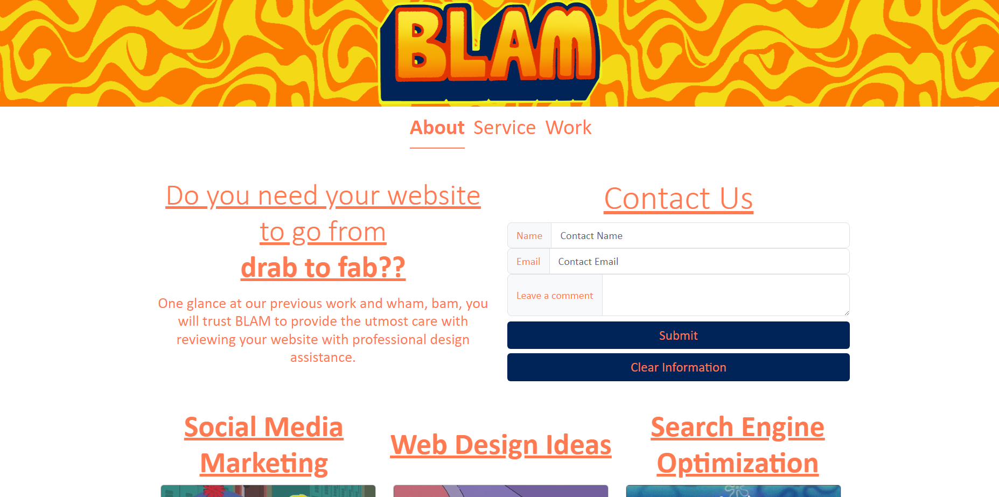
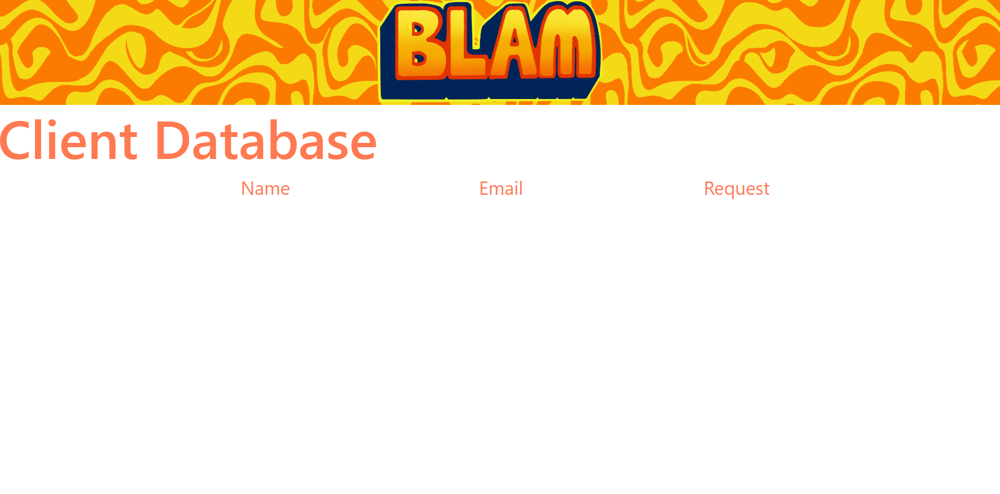

# BLAM

Project name: Project BLAM

Description: We created a Web design marketing firm with a need of a website that is capable of gathering comments of what potential clients would like to see on their own websites.  With the information that the clients send in through the landing page, it will be saved within the local storage where the company can access and review.
Technologies used: GitHub, Bootstrap and VSCode

Screenshot:

Github Repository link:

https://github.com/bmurfield/BLAM

Link to deployed application:

https://bmurfield.github.io/BLAM/

https://bmurfield.github.io/BLAM/contact.html
